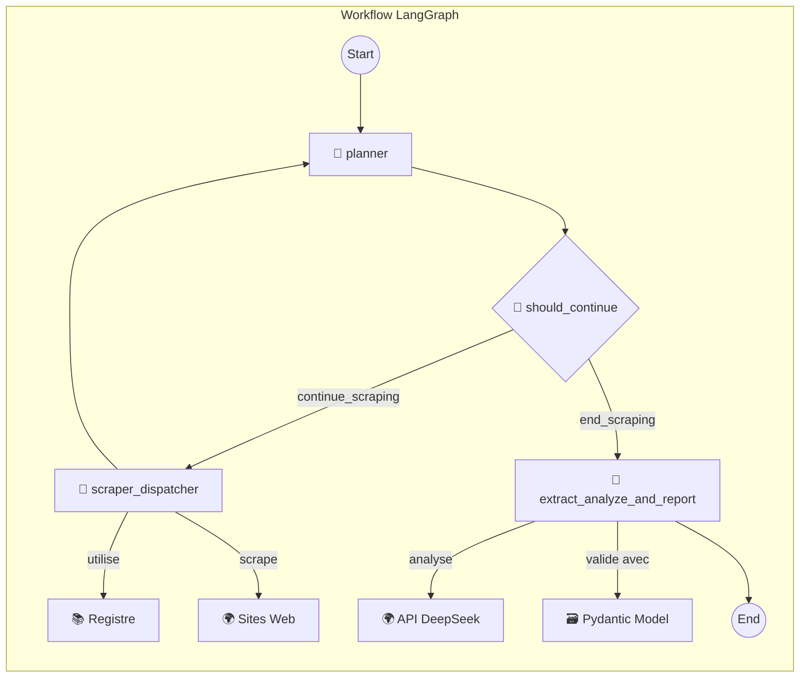

Absolument. Voici le `README.md` complet, correctement formaté en Markdown, prêt à être copié-collé dans votre projet.

---

# 🤖 Agent de Veille "Conscience Tech Africaine"

Cet agent intelligent est un outil de veille stratégique conçu pour analyser l'actualité technologique mondiale et en extraire des leçons critiques, des problématiques et des opportunités spécifiques au continent africain. Il va au-delà du simple scraping en utilisant un LLM pour générer une analyse géostratégique, transformant l'information brute en intelligence actionnable.

## 🎯 Mission

La mission de cet agent est de servir de **stratège pour le développement technologique africain**. Pour chaque actualité mondiale, il répond à la question fondamentale : **"Et alors ? Qu'est-ce que cela signifie pour nous, en Afrique ?"**. L'objectif est de catalyser un éveil de conscience et d'identifier des opportunités concrètes pour renforcer la souveraineté numérique et l'innovation sur le continent.

## ✨ Fonctionnalités Clés

-   **Scraping Multi-Sites :** Collecte automatiquement les derniers articles des principales sources technologiques (Techmeme, TechCabal, etc.).
-   **Extraction de Contenu Robuste :** Utilise `trafilatura` pour nettoyer le HTML et n'extraire que le corps de l'article, ignorant les publicités et les menus.
-   **Analyse en Deux Temps par LLM :**
    1.  **Contexte Global :** Génère un résumé neutre et identifie la problématique universelle de l'article.
    2.  **Analyse Stratégique pour l'Afrique :** Évalue l'impact local, révèle la problématique sous-jacente, formule un "éveil de conscience" et propose une piste d'opportunité.
-   **Scoring de Pertinence :** Attribue un score de 1 à 10 pour quantifier l'importance stratégique de chaque article pour l'Afrique.
-   **Rapport Intelligent et Classé :** Génère un rapport Markdown complet, trié par score de pertinence, présentant les articles les plus critiques en premier.
-   **Validation des Données :** Utilise **Pydantic** pour garantir que la sortie du LLM est toujours structurée et fiable, prévenant les erreurs d'analyse.
-   **Orchestration par LangGraph :** Le workflow complet est géré par un graphe d'états robuste et modulaire.
-   **Interface Web Interactive :** Une application **Streamlit** simple permet de lancer la veille et de visualiser le rapport final.

## 🚀 Démonstration

L'interface utilisateur est simple et directe. L'utilisateur lance la veille via la barre latérale, et le rapport complet et classé s'affiche dans la zone principale.

*[Insérer une capture d'écran ou un GIF de l'application Streamlit ici]*

## 🛠️ Stack Technologique

-   **Orchestration :** LangGraph
-   **Modélisation IA :** LangChain, DeepSeek API
-   **Interface Utilisateur :** Streamlit
-   **Scraping & Parsing :** Requests, BeautifulSoup, Trafilatura
-   **Validation de Données :** Pydantic
-   **Langage :** Python 3.9+

## 🏗️ Architecture

L'agent est construit sur une architecture modulaire et événementielle orchestrée par LangGraph.

### Schéma de Flux Général

```mermaid
graph TD
    subgraph "Interface Utilisateur"
        A[👤 Utilisateur] -->|Lance la Veille| B[🖥️ Frontend Streamlit];
    end
    subgraph "Logique Applicative"
        B -->|Appelle run_veile_workflow()| C[⚙️ Backend Runner];
        C -->|Invoque le graphe| D[🌐 LangGraph Workflow];
    end
    D -->|Retourne le résultat final| C;
    C -->|Formate les données| B;
    B -->|Affiche le Rapport| A;
```

### Schéma Détaillé du Graphe LangGraph



## ⚙️ Installation et Lancement

Suivez ces étapes pour lancer l'agent sur votre machine locale.

### 1. Prérequis
-   Python 3.9 ou supérieur
-   Git

### 2. Cloner le Dépôt
```bash
git clone <url-du-depot>
cd <nom-du-depot>
```

### 3. Créer un Environnement Virtuel
```bash
python -m venv .venv
# Sur Windows
.venv\Scripts\activate
# Sur macOS/Linux
source .venv/bin/activate
```

### 4. Installer les Dépendances
```bash
pip install -r requirements.txt
```

### 5. Configurer les Variables d'Environnement
Créez un fichier `.env` à la racine du projet en copiant le modèle `.env.example`.

**`.env.example`**
```ini
# Clé API pour le modèle de langage DeepSeek
DEEPSEEK_API_KEY="votre_cle_api_ici"

# Configuration optionnelle pour LangSmith (observabilité)
LANGSMITH_TRACING="true"
LANGSMITH_ENDPOINT="https://api.smith.langchain.com"
LANGSMITH_API_KEY="votre_cle_langsmith_ici"
LANGSMITH_PROJECT="nom_de_votre_projet_langsmith"
```
Remplacez `"votre_cle_api_ici"` par votre véritable clé API DeepSeek.

### 6. Lancer l'Application
```bash
streamlit run main.py
```
Ouvrez votre navigateur à l'adresse `http://localhost:8501`.

## 📂 Structure du Projet
```
.
├── backend_scraapy.py   # Cœur de la logique : graphe LangGraph, nœuds, analyse LLM
├── main.py              # Fichier de l'application Streamlit (interface utilisateur)
├── requirements.txt     # Liste des dépendances Python
├── .env                 # Fichier pour les secrets (clés API) - NE PAS COMMIT
├── .env.example         # Modèle pour le fichier .env
└── README.md            # Ce fichier
```

## 🧩 Étendre l'Agent (Ajouter un Nouveau Site)

L'architecture est conçue pour être facilement extensible. Pour ajouter un nouveau site à la veille :

1.  **Créez une fonction de scraping dédiée** dans `backend_scraapy.py`. Inspirez-vous de `scrape_techmeme` et utilisez le *travail de détective* (inspecteur du navigateur) pour trouver le bon sélecteur CSS.

    ```python
    def scrape_nouveau_site(soup: BeautifulSoup, base_url: str) -> List[FoundArticle]:
        articles = []
        # Votre logique de scraping avec le bon sélecteur CSS
        selector = "h2.article-title a" 
        for link in soup.select(selector):
            # ... extraire titre et href ...
            articles.append({"title": title, "url": url, "source": "Nouveau Site"})
        return articles
    ```

2.  **Ajoutez la fonction au `SCRAPER_REGISTRY`** dans `backend_scraapy.py`.

    ```python
    SCRAPER_REGISTRY = {
        "https://www.techmeme.com/": scrape_techmeme,
        "https://techcabal.com/": scrape_techcabal,
        # ... autres sites ...
        "https://www.nouveausite.com/": scrape_nouveau_site, # Ajoutez la nouvelle ligne ici
    }
    ```
C'est tout ! L'agent prendra automatiquement en charge le nouveau site lors de sa prochaine exécution.