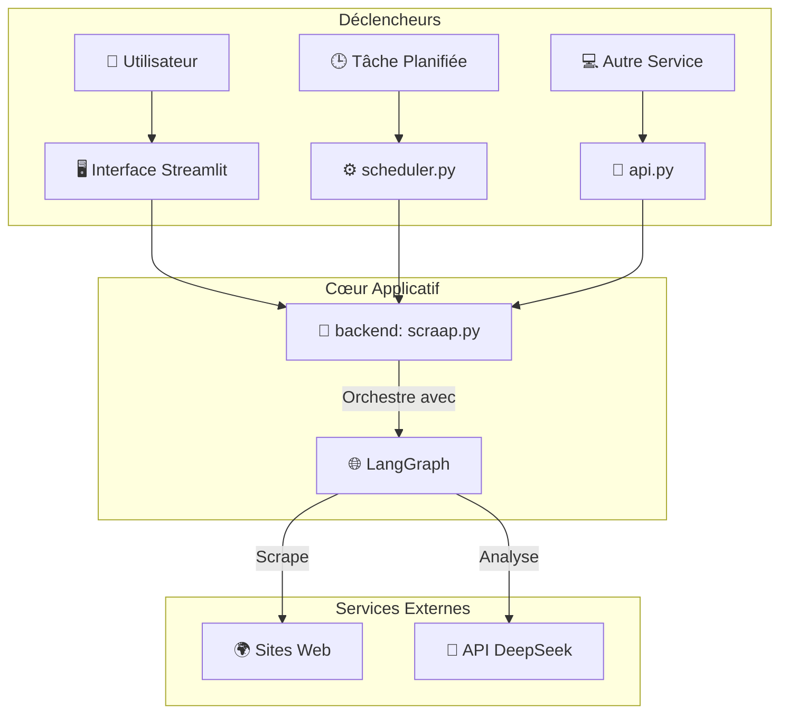

**Analyse de votre structure de fichiers :**

-   `api.py` : Suggère que vous avez une API REST (probablement FastAPI) pour exposer les résultats ou lancer la veille par programme.
-   `frontend.py` / `main.py` : Ce sont vos points d'entrée pour l'interface Streamlit.
-   `scraap.py` : C'est votre backend, le cœur logique que nous avons construit.
-   `scheduler.py` : Implique que vous avez mis en place une exécution planifiée (par exemple, un cron job quotidien).

Le `README.md` doit refléter cette structure professionnelle. Je vais réécrire le `README.md` pour qu'il corresponde parfaitement à votre projet, en expliquant le rôle de chaque fichier et comment lancer les différents composants.

---

### **Le `README.md` Final, Adapté à Votre Projet**

Voici la version finale. Effacez le contenu de votre `readme.md` actuel et remplacez-le par celui-ci.

```markdown
# 🤖 Agent de Veille "Conscience Tech Africaine"

Cet agent intelligent est un outil de veille stratégique conçu pour analyser l'actualité technologique mondiale et en extraire des leçons critiques, des problématiques et des opportunités spécifiques au continent africain. Il va au-delà du simple scraping en utilisant un LLM pour générer une analyse géostratégique, transformant l'information brute en intelligence actionnable.

## ✨ Fonctionnalités Clés

-   **Scraping Multi-Sites :** Collecte automatiquement les derniers articles des principales sources technologiques (Techmeme, TechCabal, etc.).
-   **Analyse Stratégique Complète :** Pour chaque article, génère un résumé neutre, identifie la problématique globale, puis fournit une analyse contextuelle pour l'Afrique (impact, éveil de conscience, opportunités).
-   **Scoring de Pertinence :** Attribue un score de 1 à 10 pour quantifier l'importance stratégique de chaque article pour l'Afrique, permettant un tri efficace.
-   **Orchestration Robuste :** Le workflow complet est géré par **LangGraph**, assurant une exécution modulaire et résiliente.
-   **Validation des Données :** Utilise **Pydantic** pour garantir que la sortie du LLM est toujours structurée et fiable.
-   **Modes d'Exécution Multiples :** Peut être lancé via une interface web interactive (Streamlit), une API REST, ou de manière planifiée.

## 🏗️ Architecture

Le projet est conçu avec une séparation claire des responsabilités, le rendant robuste et maintenable.

-   **Backend (`scraap.py`) :** Le cœur du système. Contient le graphe LangGraph, les fonctions de scraping (`BeautifulSoup`), et la logique d'analyse LLM.
-   **Frontend (`frontend.py`) :** Une interface web interactive construite avec **Streamlit** pour des démonstrations et une utilisation manuelle.
-   **API (`api.py`) :** Une interface REST (probablement **FastAPI**) qui expose la logique de veille, permettant à d'autres services de consommer les résultats.
-   **Scheduler (`scheduler.py`) :** Un script pour lancer la veille de manière automatisée et périodique (ex: tous les jours à 8h).



## ⚙️ Installation et Lancement

### 1. Prérequis
-   Python 3.9+
-   Git

### 2. Installation
```bash
# Cloner le dépôt
git clone <url-du-depot>
cd <nom-du-depot>

# Créer et activer un environnement virtuel
python -m venv .venv
source .venv/bin/activate  # ou .venv\Scripts\activate sur Windows

# Installer les dépendances
pip install -r requirements.txt
```

### 3. Configuration
Créez un fichier `.env` à la racine du projet et remplissez-le avec vos clés API, en vous basant sur `.env.example` (s'il existe).

```ini
DEEPSEEK_API_KEY="votre_cle_api_ici"
# ... autres variables d'environnement si nécessaire ...
```

### 4. Modes d'Exécution

Vous pouvez lancer l'agent de trois manières différentes :

#### a) Mode Interactif (Interface Web)
Idéal pour les démonstrations et l'utilisation manuelle.
```bash
# Assurez-vous que votre fichier frontend s'appelle `frontend.py` ou ajustez la commande
streamlit run frontend.py
```
Ouvrez votre navigateur à l'adresse `http://localhost:8501`.

#### b) Mode API
Pour intégrer l'agent à d'autres applications.
```bash
# Lance le serveur API (en supposant l'utilisation de FastAPI/Uvicorn)
uvicorn api:app --reload
```
L'API sera accessible sur `http://localhost:8000`.

#### c) Mode Planifié (Tâche de Fond)
Pour une veille automatisée et régulière.
```bash
# Lance le script du scheduler
python scheduler.py
```

## 📂 Structure du Projet

```
.
├── api.py               # Serveur API (FastAPI/Flask) pour exposer la logique.
├── frontend.py          # Application web interactive (Streamlit).
├── main.py              # Potentiel point d'entrée alternatif ou script de lancement.
├── scraap.py            # Cœur logique : LangGraph, scraping, analyse. (Suggestion: renommer en backend.py)
├── scheduler.py         # Script pour l'exécution planifiée de la veille.
|
├── requirements.txt     # Dépendances Python.
├── .env                 # Fichier des secrets (clés API).
└── README.md            # Ce fichier.
```

## 🧩 Étendre l'Agent (Ajouter un Nouveau Site)

L'architecture est conçue pour être facilement extensible via le **Registre de Scrapers**.

1.  **Créez une fonction de scraping dédiée** dans `scraap.py` en utilisant `BeautifulSoup` pour trouver le bon sélecteur CSS.

    ```python
    def scrape_nouveau_site(soup: BeautifulSoup, base_url: str) -> List[FoundArticle]:
        articles = []
        selector = "h2.article-title a" # Exemple de sélecteur
        for link in soup.select(selector):
            # ... extraire titre et href ...
            articles.append({"title": title, "url": url, "source": "Nouveau Site"})
        return articles
    ```

2.  **Ajoutez la fonction au `SCRAPER_REGISTRY`** dans `scraap.py`.

    ```python
    SCRAPER_REGISTRY = {
        # ... autres sites ...
        "https://www.nouveausite.com/": scrape_nouveau_site,
    }
    ```

